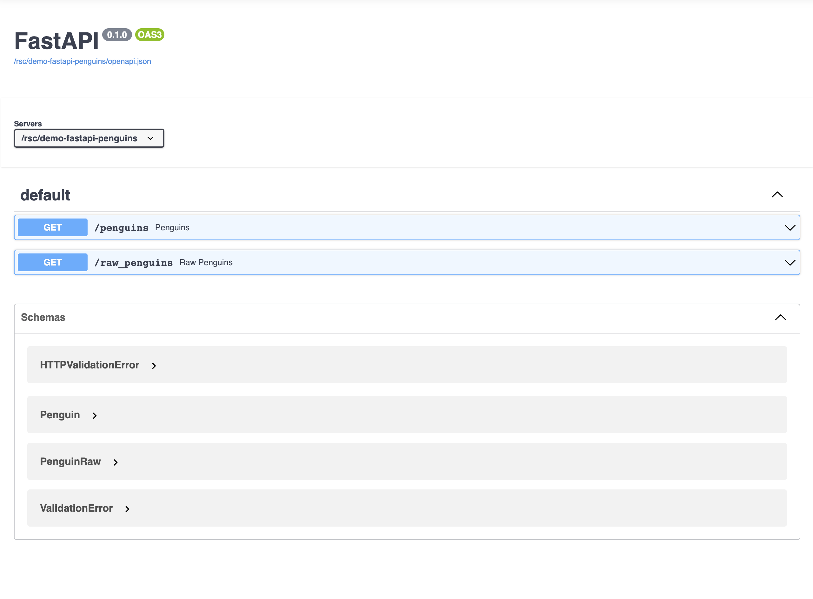

# demo-fastapi-penguins

A simple Fast API app for demos.



## Usage

Create a virtual environment.

```bash
python -m venv .venv
source .venv/bin/activate
python -m pip install --upgrade pip wheel setuptools
pip install -r app/requirements.txt
```

Then run the app.

```bash
uvicorn app.main:app --reload
```

You could also call the API using `curl`:

```bash
curl -X 'GET' \
  'https://colorado.rstudio.com/rsc/demo-fastapi-penguins/penguins?sample_size=1' \
  -H 'accept: application/json'
```

If the API is private you will need to authenticate using your API key.

```bash
curl -X 'GET' \
  'https://colorado.rstudio.com/rsc/demo-fastapi-penguins/penguins?sample_size=1' \
  -H 'accept: application/json' \
  -H "Authorization: Key ${CONNECT_API_KEY}"
```

## Deployment

### Git-backed

The app is automatically deployed to RStudio connect using git backed deployment. Make any changes to the code, then run the following:

```bash
rsconnect write-manifest fastapi \
  --overwrite \
  --python .venv/bin/python \
  --entrypoint main:app \
  app
```

> ⚠️ Remember to update the app/requirements.txt file if you add any new packages.

### Programatic

You can deploy the app using the rsconnect cli:

```bash
rsconnect deploy fastapi \
  --python .venv/bin/python \
  --entrypoint main:app \
  --new \
  app
```