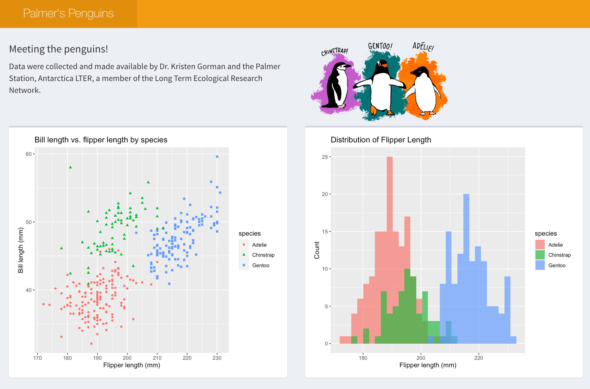

# demo-shiny-penguins

Palmer's penguins shiny dashboard demo.



## Usage

```r
shiny::runApp('app')
```

## Deployment

### Git-backed

Update the code, and then run:

```r
rsconnect::writeManifest("app")
```

The app will be automatically redeployed by RStudio Connect.

### Programatic

You can also deploy the app using the `rsconnect` api:

```r
rsconnect::deployApp(
  appDir = "app",
  appFiles = c("app.R"),
  appTitle = "Shiny Penguins API Deployment"
)
```
